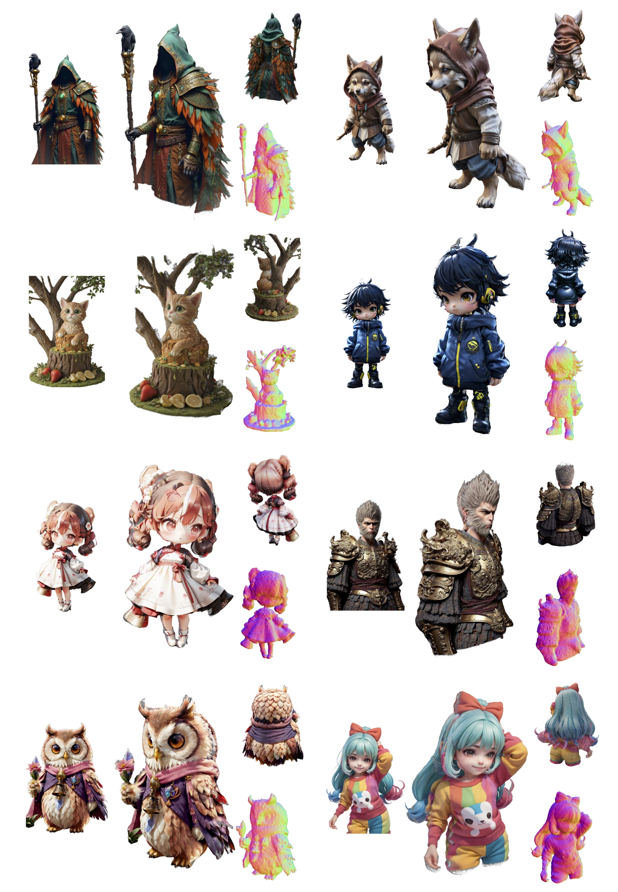
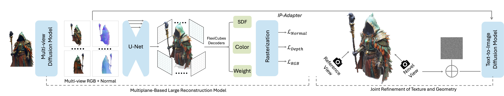

# DreamCraft3D++

[**Paper**](https://arxiv.org/abs/2410.12928) | [**Project Page**](https://dreamcraft3dplus.github.io/) | [**Youtube Video**](https://www.youtube.com/watch?v=0FazXENkQms) | [**ICLR Version**](https://mrtornado24.github.io/DreamCraft3D/)

Official implementation of DreamCraft3D++: Efficient Hierarchical 3D Generation with Multi-Plane Reconstruction Model

[Jingxiang Sun](https://mrtornado24.github.io/), [Cheng Peng](https://pengc02.github.io/), [Ruizhi Shao](https://dsaurus.github.io/saurus/), [Yuanchen Guo](https://scholar.google.com/citations?user=b7ZJV9oAAAAJ&hl=en), [Xiaochen Zhao](https://xiaochen-zhao.netlify.app/), [Yangguang Li](https://scholar.google.com/citations?user=a7AMvgkAAAAJ&hl=zh-CN), [Yanpei Cao](https://yanpei.me/), [Bo Zhang](https://bo-zhang.me/), [Yebin Liu](https://liuyebin.com/)


Abstract: *We introduce DreamCraft3D++, an extension of DreamCraft3D that enables efficient high-quality generation of complex 3D assets. DreamCraft3D++ inherits the multi-stage generation process of DreamCraft3D, but replaces the time-consuming geometry sculpting optimization with a feed-forward multi-plane based reconstruction model, speeding up the process by 1000x. For texture refinement, we propose a training-free IP-Adapter module that is conditioned on the enhanced multi-view images to enhance texture and geometry consistency, providing a 4x faster alternative to DreamCraft3D's DreamBooth fine-tuning. Experiments on diverse datasets demonstrate DreamCraft3D++'s ability to generate creative 3D assets with intricate geometry and realistic 360° textures, outperforming state-of-the-art image-to-3D methods in quality and speed. The full implementation will be open-sourced to enable new possibilities in 3D content creation.*

<p align="center">
    
</p>


## Method Overview
<p align="center">
    
</p>


<!-- https://github.com/MrTornado24/DreamCraft3D/assets/45503891/8e70610c-d812-4544-86bf-7f8764e41067


https://github.com/MrTornado24/DreamCraft3D/assets/45503891/b1e8ae54-1afd-4e0f-88f7-9bd5b70fd44d


https://github.com/MrTornado24/DreamCraft3D/assets/45503891/ead40f9b-d7ee-4ee8-8d98-dbd0b8fbab97 -->


## Credits
This code is built on the amazing open-source projects [threestudio-project](https://github.com/threestudio-project/threestudio) and [stable-dreamfusion](https://github.com/ashawkey/stable-dreamfusion).

## Related links
- [DreamCraft3D](https://mrtornado24.github.io/DreamCraft3D/)
- [DreamFusion](https://dreamfusion3d.github.io/)
- [Magic3D](https://research.nvidia.com/labs/dir/magic3d/)
- [Make-it-3D](https://make-it-3d.github.io/)
- [Magic123](https://guochengqian.github.io/project/magic123/)
- [ProlificDreamer](https://ml.cs.tsinghua.edu.cn/prolificdreamer/)
- [LGM](https://github.com/3DTopia/LGM)
- [IPDreamer](https://github.com/zengbohan0217/IPDreamer)

## BibTeX

```bibtex
@article{sun2023dreamcraft3d,
  title={Dreamcraft3d: Hierarchical 3d generation with bootstrapped diffusion prior},
  author={Sun, Jingxiang and Zhang, Bo and Shao, Ruizhi and Wang, Lizhen and Liu, Wen and Xie, Zhenda and Liu, Yebin},
  journal={arXiv preprint arXiv:2310.16818},
  year={2023}
}
```
